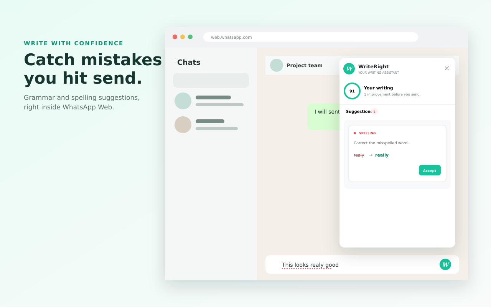
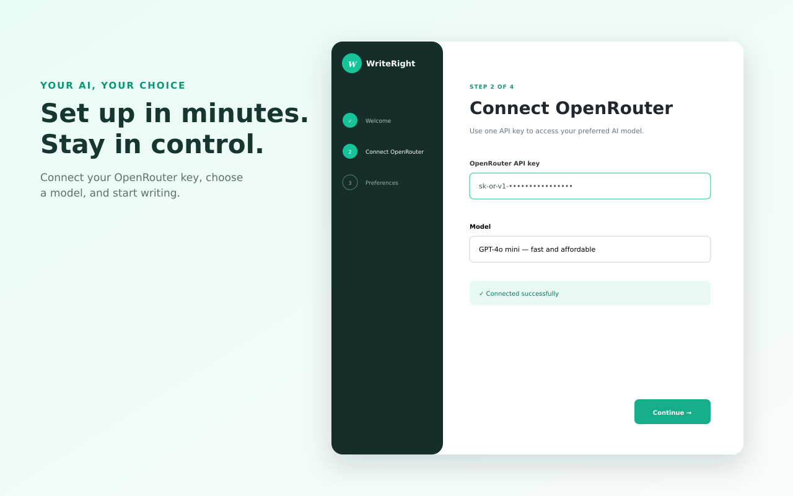
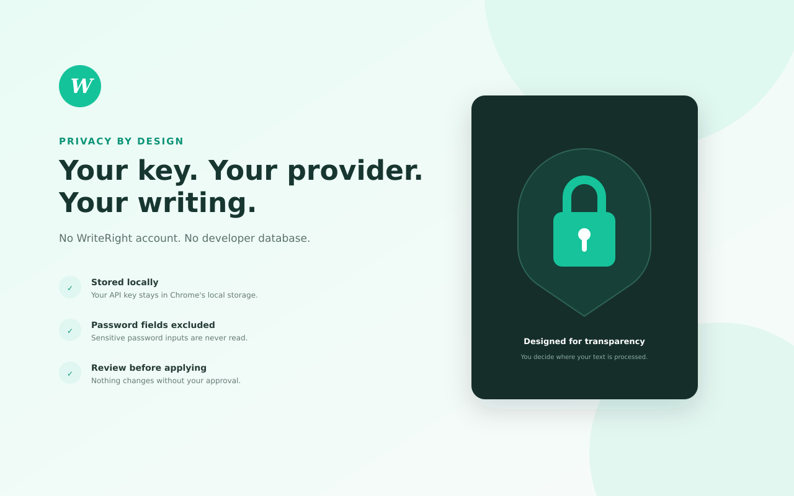

<p align="center">
  
</p>

<h1 align="center">WriteRight</h1>

<p align="center"><strong>AI spelling and grammar help wherever you type.</strong></p>

<p align="center">
  A privacy-conscious Chrome Manifest V3 extension powered by your own OpenRouter account.<br>
  Review clear, actionable suggestions in WhatsApp Web and editable fields across the web.
</p>

<p align="center">
  <a href="#install-in-chrome">Install</a> ·
  <a href="#features">Features</a> ·
  <a href="#how-it-works">How it works</a> ·
  <a href="PRIVACY_POLICY.md">Privacy</a> ·
  <a href="STORE_LISTING.md">Store listing</a> ·
  <a href="DEBRIEF_FOR_OPUS.md">Technical debrief</a> ·
  <a href="PRODUCT_PLAN_V2.md">V2 plan</a> ·
  <a href="DESIGN_SYSTEM.md">Design system</a> ·
  <a href="design-v2/README.md">V2 designs</a>
</p>


> **Release status:** v1.0.0 release candidate. The source, Web Store artwork, listing copy, privacy policy, and ready-to-upload ZIP are included in this repository. The v2 screens below are approval-stage designs, not implemented runtime features yet.

## WriteRight v2 full UI/UX review

The proposed v2 experience adds five rewrite modes, comparison before replacement, technical and researched review, reusable prompts, writing profiles, custom modes, and voice onboarding. Read the [complete product plan](PRODUCT_PLAN_V2.md), [design system](DESIGN_SYSTEM.md), or [focused design review](design-v2/README.md).

### 1. Five-mode rewrite launcher

Select text and choose **Polish**, **Casual**, **Polite**, **Professional & Firm**, or **Technical Review** without leaving the page.


### 2. Before-and-after rewrite approval

The original remains unchanged while the user reviews the proposal, meaning-preservation status, and length or directness adjustments.


### 3. Technical and factual review

Logic review runs without browsing. Research is an explicit option that adds source cards, claim relationships, and calibrated verdicts.


### 4. Saved prompts and writing profiles

Reusable prompts handle quick tasks. Rich profiles hold voice samples, terminology, audience, locale, and site assignments for Work and Personal contexts.


### 5. Add a custom mode

Users can define a mode in plain language, choose its behavior, add guardrails, test it, and save it beside the built-in modes.


### 6. Voice-profile onboarding

Setup explains what voice samples affect, where they are stored, and how Personal and Work profiles differ.


> Editable SVG sources for every screen are included in [`design-v2/`](design-v2/). Review comments should reference the screen number and the specific element to change.

## Current v1 product preview

### Catch mistakes before you send

WriteRight detects spelling, grammar, and punctuation issues without pulling you away from the page where you are writing.



### Guided OpenRouter setup

A four-step onboarding flow helps users connect their key, choose a model, verify the connection, and set writing preferences.



### Designed for transparency

There is no WriteRight account or developer-operated writing database. The user chooses the provider and approves every edit.



## Features

- **Works where you write:** supports text inputs, textareas, and `contenteditable` editors, including WhatsApp Web.
- **AI proofreading:** checks spelling, grammar, punctuation, and clear writing errors.
- **Review-first corrections:** accept one suggestion or all currently valid suggestions.
- **Bring your own API key:** connects directly to OpenRouter from the extension service worker.
- **Model choice:** select an OpenRouter model during setup or configure one in advanced settings.
- **Live connection test:** validates the key and model before setup is completed.
- **Writing status:** shows a suggestion count and a simple quality indicator.
- **Stale-edit protection:** verifies the original range before applying an AI correction.
- **Local preferences:** key, model, language, and enabled state are stored with `chrome.storage.local`.
- **Accessible interface:** keyboard focus states, responsive layouts, semantic labels, and reduced-motion support.
- **No password collection:** password fields are excluded from proofreading.

## Install in Chrome

### Option A — use the packaged release

1. Download [`writeright-extension.zip`](writeright-extension.zip).
2. Extract it to a permanent directory on your computer.
3. Open `chrome://extensions` in Chrome.
4. Enable **Developer mode** in the upper-right corner.
5. Click **Load unpacked**.
6. Select the extracted directory containing `manifest.json`.
7. Complete the WriteRight setup wizard.
8. Refresh any tabs that were already open.

### Option B — install from source

```bash
git clone https://github.com/yuriohz/yugi.git
cd yugi
git checkout arena/01a0dbec-yugi
```

Then load the repository directory through `chrome://extensions` as described above.

> The GitHub repository owner may rename the repository to `writeright-extension`. If renamed, use the updated clone URL shown by GitHub.

## Configure OpenRouter

1. Create an API key at [openrouter.ai/settings/keys](https://openrouter.ai/settings/keys).
2. Paste the key into the first-install wizard.
3. Select a compatible model.
4. Choose **Test connection**.
5. Select your writing language and enable proofreading.

The default API endpoint is:

```text
https://openrouter.ai/api/v1/chat/completions
```

OpenRouter or the selected model may charge for requests. WriteRight does not provide API credits.

## How it works

```text
Editable field
     │
     │ typing pause (700 ms)
     ▼
Content script
     │ chrome.runtime message
     ▼
Manifest V3 service worker
     │ authenticated HTTPS request
     ▼
OpenRouter / selected model
     │ structured issue list
     ▼
Suggestion panel → user reviews → accepted edits are applied
```

1. `content.js` observes supported editable fields through delegated browser events.
2. After a short typing pause, the current field text is sent to `background.js`.
3. The background service worker reads the locally stored API configuration.
4. It requests structured proofreading results from OpenRouter.
5. Returned offsets are validated before being shown.
6. The user explicitly accepts individual corrections or all valid corrections.
7. WriteRight dispatches an `InputEvent` so framework-controlled editors can detect the change.

## Architecture

| File or directory | Responsibility |
|---|---|
| `manifest.json` | Manifest V3 declaration, permissions, icons, popup, options, and content injection |
| `background.js` | OpenRouter requests, response validation, connection testing, and first-install launch |
| `content.js` / `content.css` | Editable-field detection, suggestion workflow, in-page badge, and review panel |
| `onboarding.*` | Four-step first-install setup wizard |
| `popup.*` | Toolbar status and settings launcher |
| `options.*` | Endpoint, API key, model, language, and enable/disable settings |
| `icons/` | Extension icons required by Chrome |
| `store-assets/` | Web Store screenshots, promotional images, and editable SVG sources |
| `package.sh` | Validation, secret scanning, and deterministic ZIP packaging |

The extension has no runtime npm dependencies, build step, remotely hosted code, analytics service, or first-party backend.

## Privacy and permissions

WriteRight requests:

- **`storage`** to keep settings and the API key in local extension storage.
- **`<all_urls>` host access** to place the proofreading interface in editable fields across websites and contact the configured API endpoint.

Text in an active supported field is sent to the configured provider after the user pauses typing. Password fields are excluded. WriteRight does not operate a server or database, but OpenRouter and the selected upstream provider have their own data-handling policies.

Read the full [Privacy Policy](PRIVACY_POLICY.md) and the security discussion in the [Technical Debrief](DEBRIEF_FOR_OPUS.md#4-privacy-and-security-assessment).

## Build and validate the Chrome package

The repository includes a packaging script that:

- validates `manifest.json`;
- syntax-checks all extension JavaScript;
- scans the project for likely embedded API keys;
- packages only runtime files and icons.

Run:

```bash
chmod +x package.sh
./package.sh
unzip -t writeright-extension.zip
```

The resulting `writeright-extension.zip` can be uploaded to the Chrome Web Store Developer Dashboard.

## Chrome Web Store publication

The repository already includes:

- [store title, descriptions, and permission justification](STORE_LISTING.md);
- [privacy policy](PRIVACY_POLICY.md);
- three 1280×800 screenshots;
- a 440×280 promotional tile;
- a 1400×560 marquee image;
- editable SVG sources;
- a validated upload ZIP.

The publisher still needs to perform these account-level steps:

1. Test the extension manually in current Chrome and WhatsApp Web.
2. Host the privacy policy at a stable public HTTPS URL.
3. Upload `writeright-extension.zip` in the Chrome Web Store Developer Dashboard.
4. Upload the included artwork from `store-assets/`.
5. Complete Google's privacy-practices questionnaire accurately.
6. Submit the extension for review.

See [STORE_LISTING.md](STORE_LISTING.md) for copy and dashboard details.

## Documentation

| Document | Description |
|---|---|
| [Privacy Policy](PRIVACY_POLICY.md) | Data processed, credential storage, retention, sharing, and permissions |
| [Chrome Web Store Listing](STORE_LISTING.md) | Marketing copy, category, permission rationale, asset inventory, and submission details |
| [Engineering & Product Debrief](DEBRIEF_FOR_OPUS.md) | Architecture, product decisions, security assessment, limitations, QA status, and reviewer prompts |
| [V2 Product Plan](PRODUCT_PLAN_V2.md) | Grammarly gap analysis, anti-slop strategy, five modes, prompt profiles, architecture, delivery phases, and acceptance criteria |
| [Design System](DESIGN_SYSTEM.md) | Visual principles, tokens, typography, components, motion, accessibility, content design, privacy UX, and responsive behavior |
| [V2 Design Review](design-v2/README.md) | Six actual 1440×900 product design screenshots with editable SVG sources |
| [MIT License](LICENSE) | Open-source license |

## Known limitations

- Chrome internal pages and the Chrome Web Store do not allow ordinary content scripts.
- Sandboxed iframes, closed shadow roots, canvas editors, and highly customized editors may require site-specific adapters.
- Plain input elements do not expose styleable text ranges; exact corrections are shown in the review panel while the field receives issue styling.
- Model quality and structured-output support vary across OpenRouter models.
- AI suggestions may be incorrect and should always be reviewed.

## Release checklist

- [x] Manifest V3 runtime
- [x] OpenRouter integration
- [x] First-install wizard
- [x] Popup and settings interfaces
- [x] In-page suggestion workflow
- [x] Privacy policy and listing copy
- [x] Store screenshots and promotional artwork
- [x] Secret-scanning package script
- [x] Ready-to-upload ZIP
- [ ] Manual acceptance test in the publisher's current Chrome installation
- [ ] Chrome Web Store privacy questionnaire
- [ ] Chrome Web Store review and publication

## License

WriteRight is available under the [MIT License](LICENSE).
