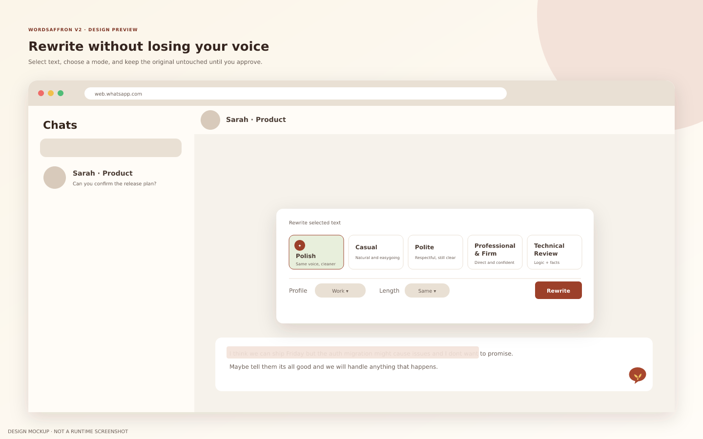
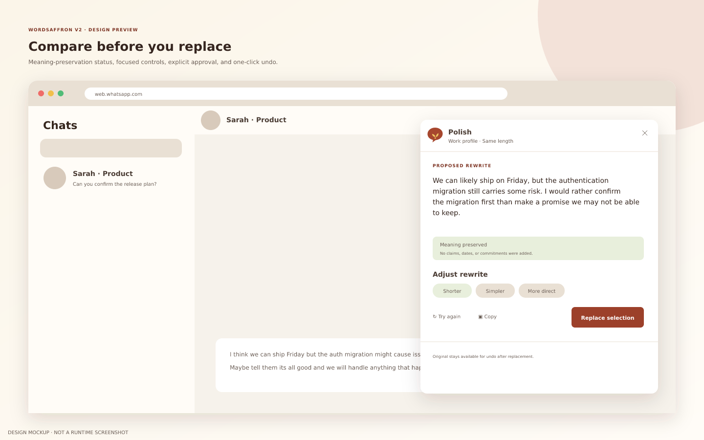
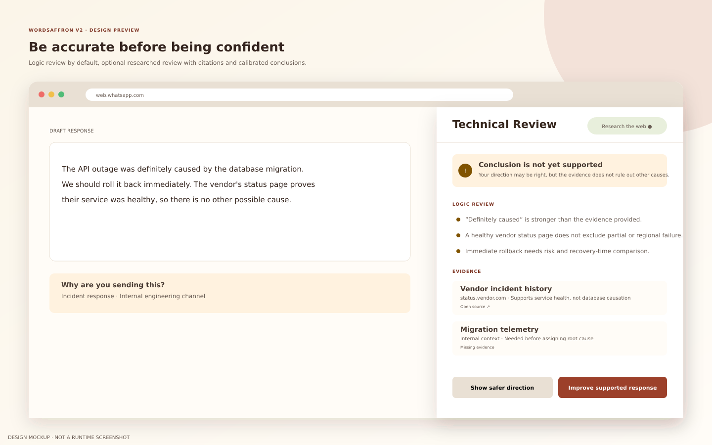
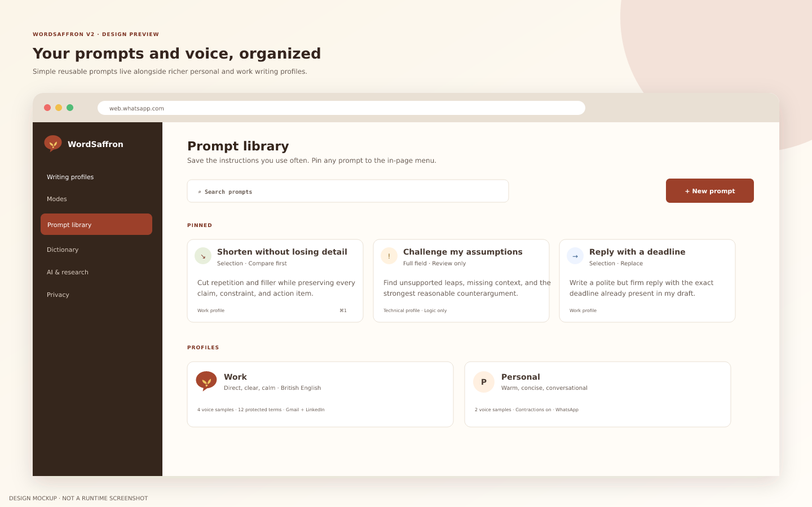
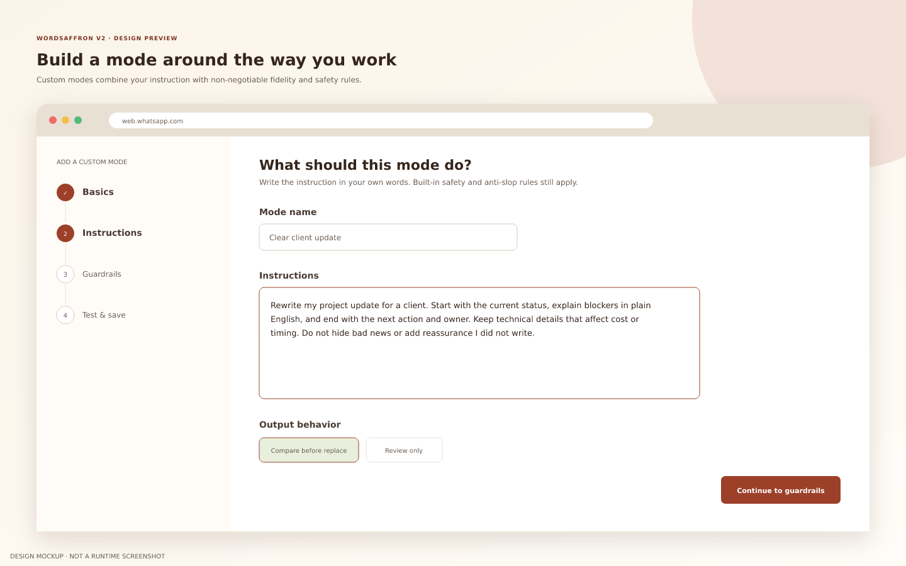
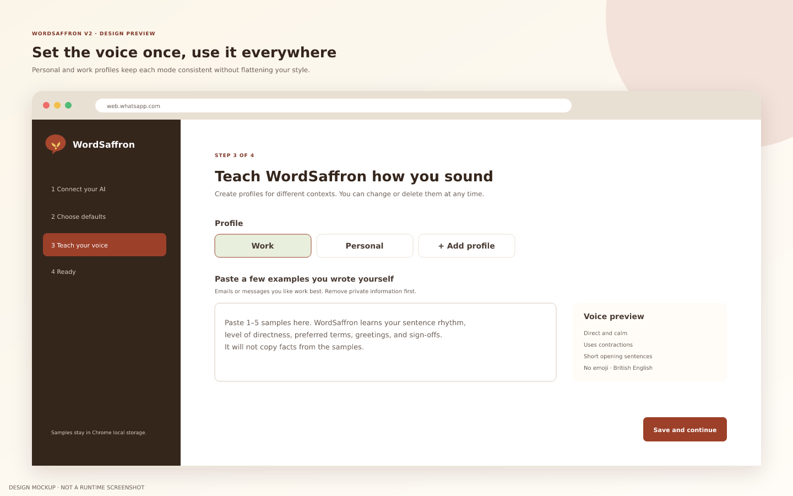

# WordSaffron v2 design review

> Rebranded to WordSaffron/Tactile on 27 September 2026 (Stage 4). These remain
> **design mockups**, not runtime screenshots. See `store-assets/README.md` for
> the store-image provenance rules.

These screens are high-fidelity product design mockups for the proposed v2 experience. They are provided for approval before runtime implementation begins. They do not claim that the current extension already has these features.

## 1. Rewrite mode picker

The selected-text workflow exposes five first-class modes without forcing the user into a separate application. Profile and length controls remain visible before generation.

## 2. Rewrite comparison

The original remains untouched while the user reviews a proposal. Meaning-preservation status, targeted adjustments, copy, retry, replace, and undo support keep the user in control.

## 3. Technical Review

Technical Review separates logic problems from evidence. Web research is explicit, sources are visible, and the verdict uses calibrated language rather than claiming the user is always right.

## 4. Prompt library and profiles

Reusable prompts are simple to search and pin. Profiles hold the richer voice, audience, terminology, locale, and site-specific behavior requested for personal and work contexts.

## 5. Custom mode builder

The step-based builder supports plain-language instructions, operation type, output behavior, guardrails, testing, and profile defaults. Built-in fidelity and anti-slop rules remain active.

## 6. Voice onboarding

Onboarding explains what voice samples influence and reminds the user to remove private information. Samples remain in local Chrome storage.

## Editable sources

Each PNG has a matching SVG file in this directory. The PNG exports are 1440×900. Changes should be made in the SVG source and exported again so the review artifacts and approved specification stay aligned.

Provider refresh (26 September 2026): sidebar copy now says “Connect your AI”.
All PNGs were re-rendered with `@resvg/resvg-js`, `loadSystemFonts: true`.
Unsupported foreignObject text in 02, 05 and 06 was replaced with SVG text/tspan
so it remains visible. All images explicitly remain design mockups, not screenshots.
